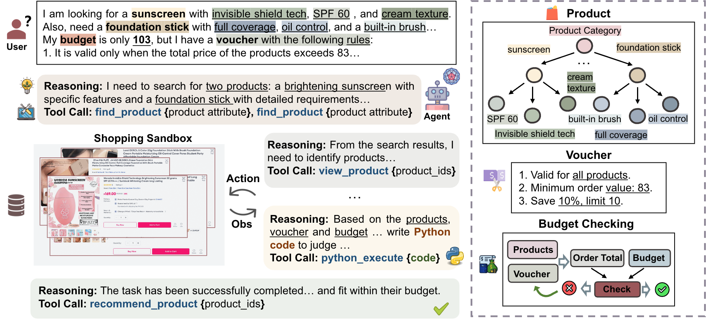

# ShoppingBench: A Real-World Intent-Grounded Shopping Benchmark for LLM-based Agents

[](https://arxiv.org/abs/2508.04266)
<!-- [](https://huggingface.co/datasets/your-dataset-link) -->

## Overview

ShoppingBench is a novel end-to-end shopping benchmark designed to encompass increasingly challenging levels of grounded intent. Specifically, we propose a scalable framework to simulate user instructions based on various intents derived from sampled real-world products. To facilitate consistent and reliable evaluations, we provide a large-scale shopping sandbox that serves as an interactive simulated environment, incorporating over 2.5 million real-world products.


## Features

- various real-world shopping intents
- a large-scale shopping sandbox
- Comprehensive evaluation metrics

## Dataset

The ShoppingBench dataset includes:

1. **documents.jsonl.gz**: A compressed file containing product documents (located in `resources/` directory)
   - To decompress: `gunzip -c resources/documents.jsonl.gz > resources/documents.jsonl`
   - Size: ~1.4GB compressed, ~4.8GB uncompressed

2. **Test files**: Located in the `data/` directory
   - `synthesize_product_test.jsonl`: Product Intent test cases
   - `synthesize_shop_test.jsonl`: Shop Intent test cases  
   - `synthesize_voucher_test.jsonl`: Voucher Intent test cases
   - `synthesize_web_simpleqa_test.jsonl`: Web search Intent test cases

## Environment Setup

### prerequist

1. install java (jdk21 recommended)

2. install uv

3. decompress documents.jsonl.gz to get documents.jsonl in resources folder:
   ```bash
   gunzip -c resources/documents.jsonl.gz > resources/documents.jsonl
   ```

4. prepare related KEY
```bash
export OPENAI_API_KEY="your openai api key"
export OPENAI_BASE_URL="your openai base url"
export SERPER_KEY="your serper web search key"
```

### Python Environment Installation and Search Engine Preparation

Run the initialization script to set up the Python environment and start the product search engine:

```bash
./init_env.sh
```

After running the environment setup script, the search engine will be automatically started in the background. 


## Running Inference and Evaluation

To run model inference on test data and evaluate the models for different intents:

1. download testset.zip and 
   ```bash
   unzip testset.zip 
   ```
   
2. Run the inference scripts (take gpt-4.1 as example):
   
   The script will automatically create necessary directories and validate the data folder structure before running model inference and evaluation.

   ```bash
   ./run.sh product rollout gpt-4.1
   ./run.sh shop rollout gpt-4.1
   ./run.sh voucher rollout gpt-4.1
   ./run.sh web simpleqa_rollout gpt-4.1
   ```

   the inference process will be running in background, you can check the log in logs folder. you can uncomment the specific line to evaluate the inference result or kill the inference process.


## Training SFT and RL Models

### SFT Environment Installation

Install SFT environment and its dependencies (llama factory):

```bash
cd src/sft/LLaMA-Factory
uv pip install -e ".[torch,metrics,deepspeed]" --no-build-isolation
```

### RL Environment Installation

Install RL environment and its dependencies:

```bash
cd src/rl
USE_MEGATRON=0 bash install_vllm_sglang_mcore.sh
# verl
uv pip install -e .
```

### Usage
To train the SFT and RL models:

For SFT training:  
1. prepare sft data
   ```bash
   cd src/sft
   mkdir data
   ```
   place dataset_info.json and training data in the data directory

2.  run sft scripts
```bash
   ./submit.sh yaml_file
   ```

For RL training:  
1. run rl scripts
   ```bash
   cd src/rl
   ./run_grpo.sh
   ```


## Paper

For more details about ShoppingBench, please refer to our paper
